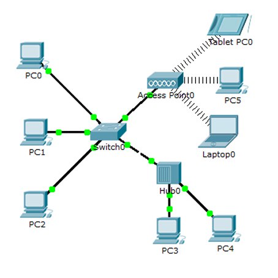
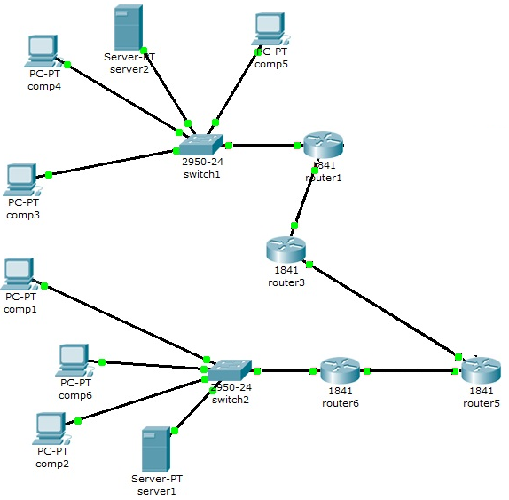
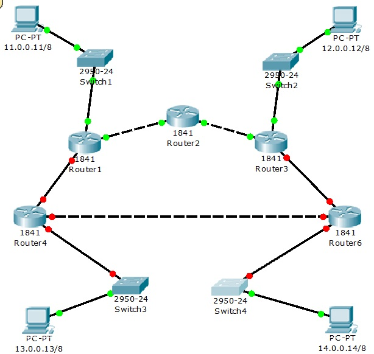
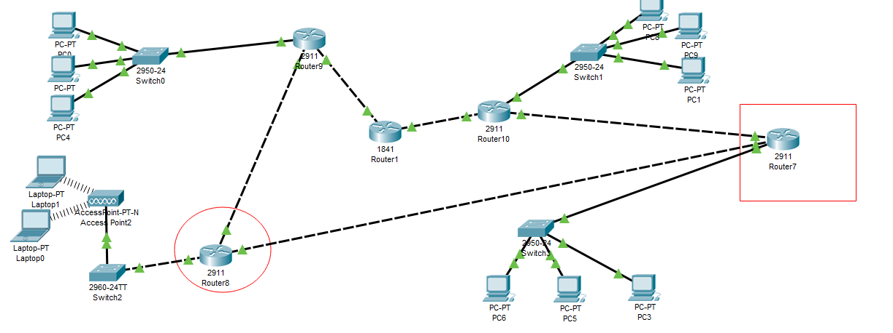

# Компьютерные сети 5 семестр

_1 и _2 разные варианты, фотографии к вариантам _1
В каждой лабе _2 есть отчеты 

## Задание № 1 

Разработать схему компьютерной сети, включающей  15 рабочих станций на основе вариантов в файле Задание 1. 
Для объединения компьютеров использовать только коммутаторы, точки доступа  и концентраторы.
Для части устройств использовать оптоволоконный кабель.  
Два стационарных компьютера подключить к беспроводной сети.
Для части устройств использовать динамическое распределение адресов. Провести настройку устройств сети.  
Задайте для ПК IP адреса из сети 192.168.0.0 с маской 255.255.255.0.
Проверить работоспособность всех устройств. Пояснить прохождение пакетов по сети.

## Задание № 2

Построить модель сети, конфигурация которой изображена на рисунке (вариант соответствует номеру по списку в подгруппе.). 
Дополнить сеть рабочими станциями (общее количество должно быть не менее 15 и присутствовать они должны в каждой подсети,
кроме подсетей, которые связывают маршрутизаторы между собой). 
Добавить не менее 3 рабочих станций, которые работают по Wi-Fi.
Провести настройку сети, проверить работоспособность и объяснить прохождения пакетов при работе. 

## Задание № 3

Построить модель сети, конфигурация которой изображена на рисунке (вариант соответствует номеру по списку в подгруппе.). 
Дополнить сеть рабочими станциями (общее количество должно быть не менее 15 и присутствовать они должны в каждой подсети,
кроме подсетей, которые связывают маршрутизаторы между собой). 
Предусмотреть хотя бы один участок сети, имеющий альтернативные маршруты. 
Все маршрутизаторы должны использовать динамическую маршрутизацию (протокол RIP). Настроить службы DNS, Email, HTTP. 
Провести настройку сети, проверить работоспособность и объяснить прохождения пакетов при работе.

## Задание № 4

Построить модель сети, конфигурация которой изображена на рисунке (вариант соответствует номеру по списку в подгруппе.).
Дополнить сеть рабочими станциями (общее количество должно быть не менее 15 и присутствовать они должны в каждой подсети,
кроме подсетей, которые связывают маршрутизаторы между собой).
Провести настройку сети, проверить работоспособность и объяснить прохождения пакетов при работе.
Использовать динамическую маршрутизацию (протокол OSPF). Настроить на одном шлюзе сети службу NAT.

## Задание № 5

Построить модель сети, конфигурация которой изображена на рисунке (вариант соответствует номеру по списку в подгруппе).
Предусмотреть хотя бы один участок сети, имеющий альтернативные маршруты. Дополнить сеть сетью  организации(фирмы),
в которой предусмотреть маршрутизатор, 5 рабочих станций,  настроить службы DNS, Email, HTTP.
Провести настройку всей сети, проверить работоспособность и объяснить прохождения пакетов при работе.
Организовать демилитаризованную зону с использованием списков доступа.
Все остальные устройства сети должны иметь доступ друг к другу.

